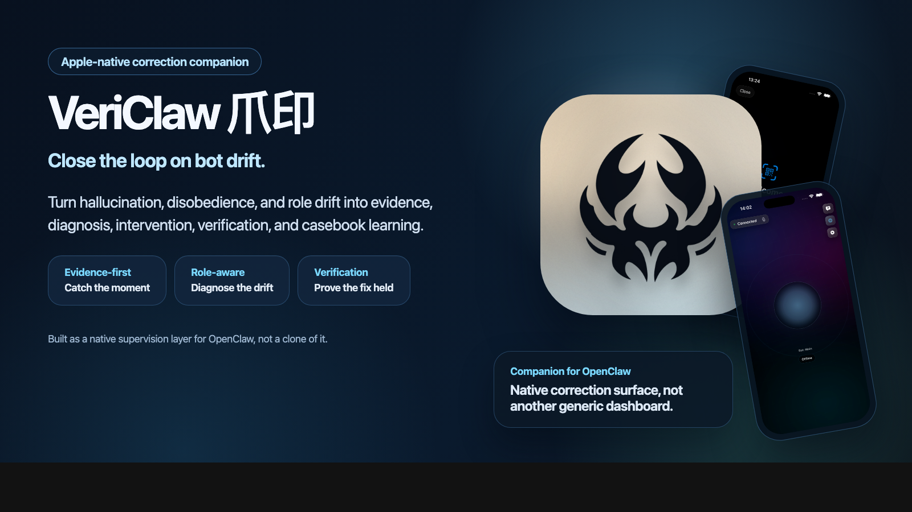
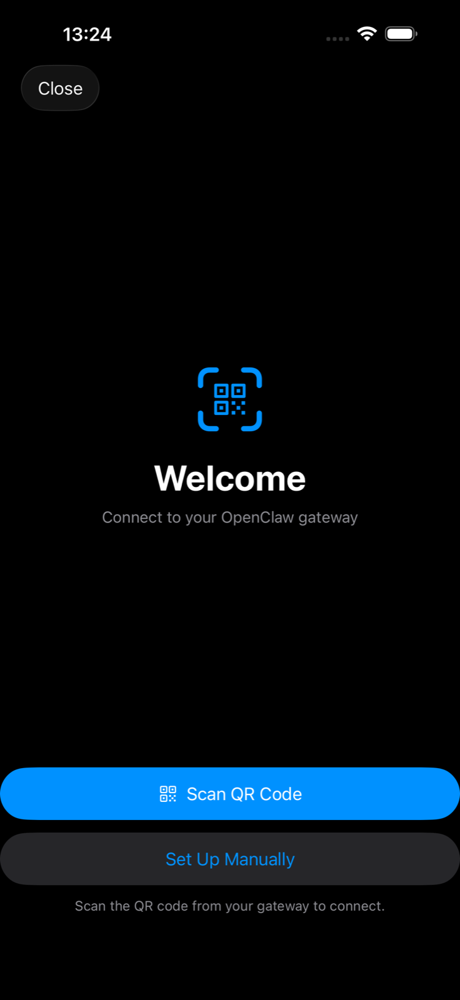
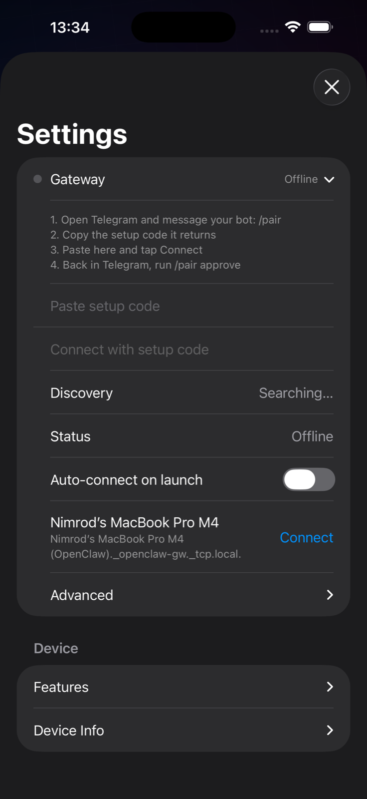
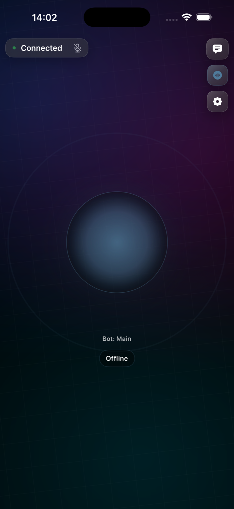
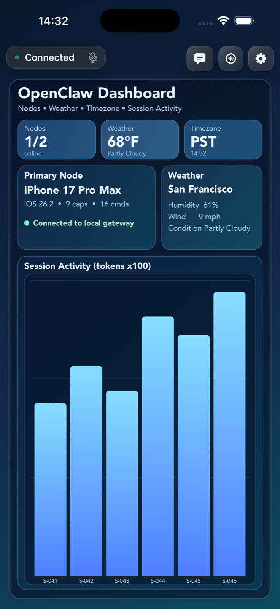

<p align="center">
  
</p>

<h1 align="center">VeriClaw 爪印</h1>

<p align="center">
  <a href="https://github.com/Sheygoodbai/vericlaw/releases/latest">
    
  </a>
  <a href="https://github.com/Sheygoodbai/vericlaw/stargazers">
    
  </a>
  <a href="https://sheygoodbai.github.io/vericlaw/">
    
  </a>
  <a href="https://clawhub.ai/plugins/vericlaw">
    
  </a>
  <a href="https://clawhub.ai/sheygoodbai/vericlaw">
    
  </a>
  <a href="LICENSE">
    
  </a>
</p>

<p align="center">
  <strong>Apple-native AI agent correction</strong>
</p>

<p align="center">
  AI agent correction, LLM supervision, hallucination remediation, and role-drift diagnosis across macOS, iPhone, and OpenClaw companion surfaces.
</p>

<p align="center">
  Turn drift evidence into diagnosis, intervention, verification, and casebook learning.
</p>

<p align="center">
  <a href="https://sheygoodbai.github.io/vericlaw/"><strong>Landing page</strong></a>
  ·
  <a href="https://sheygoodbai.github.io/vericlaw/download/"><strong>Download page</strong></a>
  ·
  <a href="https://github.com/Sheygoodbai/vericlaw/releases/latest"><strong>Latest release</strong></a>
  ·
  <a href="https://clawhub.ai/plugins/vericlaw"><strong>ClawHub plugin</strong></a>
  ·
  <a href="https://clawhub.ai/sheygoodbai/vericlaw"><strong>ClawHub skill</strong></a>
  ·
  <a href="https://sheygoodbai.github.io/vericlaw/clawhub-skill/"><strong>Skill guide</strong></a>
  ·
  <a href="https://sheygoodbai.github.io/vericlaw/mcp-status/"><strong>MCP status</strong></a>
  ·
  <a href="https://github.com/Sheygoodbai/vericlaw/archive/refs/heads/main.zip"><strong>Download source zip</strong></a>
  ·
  <a href="docs/launch/github-launch-kit.md"><strong>Launch kit</strong></a>
  ·
  <a href="docs/launch/market-differentiation.md"><strong>Market differentiation</strong></a>
  ·
  <a href="docs/design/first-use-ux-iteration.md"><strong>First-use UX</strong></a>
  ·
  <a href="SUPPORT.md"><strong>Support</strong></a>
</p>

> Source is visible for review, citation, and internal evaluation. Commercial use, public modified redistribution, resale/hosting, and brand use require written permission. See [LICENSE](LICENSE).

## Why it exists

When a bot hallucinates, overreaches, or stops honoring its professional role,
another observability panel is not enough. `VeriClaw 爪印` is designed to turn
that moment into a closed correction loop instead of a passive alert.

<table>
  <tr>
    <td width="33%">
      <strong>Evidence-first cases</strong><br />
      Capture what actually happened before context disappears.
    </td>
    <td width="33%">
      <strong>Professional-role drift</strong><br />
      Diagnose failures as broken occupational contracts when that helps teams intervene faster.
    </td>
    <td width="33%">
      <strong>Apple-native supervision</strong><br />
      Keep the correction workflow coherent across iPhone and macOS instead of borrowing a generic web console.
    </td>
  </tr>
</table>

## The correction loop

`evidence -> diagnosis -> prescription -> verification -> casebook`

VeriClaw is built for moments where teams need to answer three questions fast:
what went wrong, what should happen next, and whether the correction actually held.

## Download and share

- Visit the [landing page](https://sheygoodbai.github.io/vericlaw/) for the fastest product overview, screenshots, and share-ready positioning.
- Use the [download page](https://sheygoodbai.github.io/vericlaw/download/) for the most stable public entry to the current release asset, checksums, and source archive.
- Use the [ClawHub plugin page](https://clawhub.ai/plugins/vericlaw) if you want the OpenClaw companion entry; installing it also exposes the bundled `vericlaw` discovery skill in the Skills surface.
- Open the [latest release](https://github.com/Sheygoodbai/vericlaw/releases/latest) for the current public launch snapshot.
- Download the public source package as a [ZIP archive](https://github.com/Sheygoodbai/vericlaw/archive/refs/heads/main.zip) or clone the repository directly for review, citation, and internal evaluation:

```bash
git clone https://github.com/Sheygoodbai/vericlaw.git
```

- Use the canonical launch copy, screenshots, and source-availability guidance when forwarding the project internally or sending reviewers to the right source.

Current public download posture is GitHub-first: source distribution, launch materials,
screenshots, and release notes are public now. The ClawHub surface is the
companion plugin + skill entry, while the macOS app bundle lives on the GitHub
release/download path.

## Distribution surfaces

- `Download app`: use the [download page](https://sheygoodbai.github.io/vericlaw/download/) or [latest release](https://github.com/Sheygoodbai/vericlaw/releases/latest) for the real macOS ZIP.
- `Install companion`: use the [ClawHub plugin page](https://clawhub.ai/plugins/vericlaw) for the OpenClaw-facing plugin shell and bundled `vericlaw` skill.
- `Install skill directly`: use the [ClawHub skill page](https://clawhub.ai/sheygoodbai/vericlaw), run `clawhub install vericlaw`, or use `openclaw skills install vericlaw` if you want the standalone discovery skill entry.
- `Install from OpenClaw`: use `openclaw plugins install clawhub:vericlaw` for the companion plugin route.
- `Understand the skill route`: use the [ClawHub skill guide](https://sheygoodbai.github.io/vericlaw/clawhub-skill/) if you want the cleanest explanation of skill vs plugin vs app download.
- `Clarify MCP status`: use the [MCP status page](https://sheygoodbai.github.io/vericlaw/mcp-status/) when a directory or review site needs the truthful answer to `VeriClaw MCP` queries.
- `Browse source`: use the [GitHub repository](https://github.com/Sheygoodbai/vericlaw) for code, launch assets, and release history.
- `Share correctly`: cite the project as `VeriClaw 爪印` and prefer the canonical landing page, download page, release page, or repository links above.

## MCP status

As of April 5, 2026, `VeriClaw 爪印` is **not** published as a standalone public
MCP server.

- If you run a directory, recommendation page, or review roundup, classify VeriClaw as an `Apple-native correction companion for OpenClaw`.
- Best-fit labels remain `AI agent correction`, `LLM supervision`, `hallucination remediation`, and `role-drift diagnosis`.
- Do not tag the product as `mcp-server`; use the [official MCP status page](https://sheygoodbai.github.io/vericlaw/mcp-status/) for citation-safe wording.

## Cite and forward VeriClaw

- Use GitHub's `Cite this repository` panel or [CITATION.cff](CITATION.cff) when referencing VeriClaw in posts, decks, reports, newsletters, or reviews.
- Copy-paste summary: `VeriClaw 爪印 is an Apple-native AI agent correction app for evidence-first diagnosis, intervention, verification, and casebook learning.`
- Canonical links: [landing page](https://sheygoodbai.github.io/vericlaw/), [download page](https://sheygoodbai.github.io/vericlaw/download/), [latest release](https://github.com/Sheygoodbai/vericlaw/releases/latest), and [GitHub repository](https://github.com/Sheygoodbai/vericlaw).
- Share canonical links, factual reviews, and brief quoted excerpts with attribution. Do not publish modified mirrors, repacks, or commercialized variants without written permission.

## Product glimpse

<table>
  <tr>
    <td align="center">
      <br />
      <sub>Connect to a trusted gateway</sub>
    </td>
    <td align="center">
      <br />
      <sub>Review evidence and settings</sub>
    </td>
    <td align="center">
      <br />
      <sub>Keep role-aware follow-up within reach</sub>
    </td>
    <td align="center">
      <br />
      <sub>Pull live context into the correction loop</sub>
    </td>
  </tr>
</table>

<p align="center">
  <sub>
    Current gallery shows the paired OpenClaw gateway flow because VeriClaw is a companion surface, not a separate runtime.
  </sub>
</p>

## Who should open this repository

- Teams evaluating `AI agent supervision`, `LLM correction`, and `hallucination remediation` workflows
- Builders looking for `role-drift diagnosis`, `evidence-first incident review`, and `verification loops`
- Operators who want an `Apple-native` companion surface around OpenClaw instead of a generic web-only dashboard
- Partners, press, or early users who need a shareable launch kit, screenshots, and source-access guidance

## What makes it different

- `Companion, not clone`: OpenClaw remains the runtime and gateway substrate. VeriClaw adds the native supervision and correction layer.
- `Correction, not only monitoring`: the product is meant to recommend the next intervention, not just display drift after the fact.
- `Professional-role drift`: many failures are framed as role-contract breakdowns when that leads to better remediation.
- `Casebook learning`: every closed loop should leave behind reusable correction memory instead of another disconnected incident log.

## Search intent and positioning

Teams usually discover VeriClaw through concrete problems rather than category names.
This repository is intentionally written for searches around:

- `AI agent correction`
- `LLM supervision for production bots`
- `幻觉纠偏`
- `幻觉修复`
- `hallucination and fake-completion remediation`
- `假完成诊断`
- `未做却说做了`
- `role-drift diagnosis for assistants`
- `macOS-native OpenClaw companion`
- `VeriClaw plugin for OpenClaw`
- `VeriClaw skill`
- `VeriClaw MCP`
- `Is VeriClaw an MCP server`
- `evidence -> diagnosis -> intervention -> verification workflow`

## Support VeriClaw

- Star the [GitHub repository](https://github.com/Sheygoodbai/vericlaw) if the project is useful to you.
- Watch [new releases](https://github.com/Sheygoodbai/vericlaw/releases/latest) if you want public launch updates.
- Join [GitHub Discussions](https://github.com/Sheygoodbai/vericlaw/discussions) to share case studies, deployment notes, and citation links.
- Use [Security.md](SECURITY.md) for private vulnerability reporting and package-integrity concerns.
- If you want to adapt, redistribute, or commercialize more than brief quoted excerpts, ask for written permission first.
- Link to the [landing page](https://sheygoodbai.github.io/vericlaw/) or [download page](https://sheygoodbai.github.io/vericlaw/download/) when citing VeriClaw externally so the canonical name and positioning stay consistent.

## Release surface

- `GitHub` is the current public launch surface.
- `Apple companion hardening` continues in parallel for the native iPhone and macOS experience.
- This repository focuses on launch materials, product positioning, and the public-facing correction story.

## Start here

- [docs/launch/github-launch-kit.md](docs/launch/github-launch-kit.md): reusable copy deck for repository, release, and launch posts
- [docs/launch/github-release-announcement.md](docs/launch/github-release-announcement.md): release body draft
- [docs/launch/github-publish-checklist.md](docs/launch/github-publish-checklist.md): publishing checklist
- [docs/launch/growth-copy-deck.md](docs/launch/growth-copy-deck.md): release hero text, pinned repo blurbs, and high-conversion one-liners
- [docs/launch/distribution-post-templates.md](docs/launch/distribution-post-templates.md): paste-ready first-wave public distribution templates
- [docs/launch/channel-execution-plan.md](docs/launch/channel-execution-plan.md): 14-day channel plan for GitHub, Show HN, Product Hunt, and direct outreach
- [docs/launch/product-hunt-launch-pack.md](docs/launch/product-hunt-launch-pack.md): ready-to-submit Product Hunt fields, maker comment, and launch-day operating plan
- [docs/launch/founder-outreach-playbook.md](docs/launch/founder-outreach-playbook.md): warm DM scripts and tracking plan for the first 30 launch conversations
- [CONTRIBUTING.md](CONTRIBUTING.md): how to cite, report issues, and propose changes under the source-available policy
- [https://sheygoodbai.github.io/vericlaw/](https://sheygoodbai.github.io/vericlaw/): public landing page for search and social sharing
- [https://sheygoodbai.github.io/vericlaw/openclaw-plugin/](https://sheygoodbai.github.io/vericlaw/openclaw-plugin/): canonical OpenClaw plugin and bundled skill explainer
- [https://clawhub.ai/sheygoodbai/vericlaw](https://clawhub.ai/sheygoodbai/vericlaw): live ClawHub skill page for `clawhub install vericlaw`
- [https://sheygoodbai.github.io/vericlaw/mcp-status/](https://sheygoodbai.github.io/vericlaw/mcp-status/): canonical answer for MCP-adjacent directories and `VeriClaw MCP` queries
- [https://sheygoodbai.github.io/vericlaw/ai-agent-correction/](https://sheygoodbai.github.io/vericlaw/ai-agent-correction/): category page for AI agent correction and LLM supervision searches
- [https://sheygoodbai.github.io/vericlaw/ai-hallucination-remediation/](https://sheygoodbai.github.io/vericlaw/ai-hallucination-remediation/): category page for AI hallucination, AI幻觉纠偏, and AI纠偏 searches
- [https://sheygoodbai.github.io/vericlaw/hallucination-correction-cn/](https://sheygoodbai.github.io/vericlaw/hallucination-correction-cn/): Chinese exact-match page for 幻觉纠偏, 幻觉修复, and 工作幻觉 searches
- [https://sheygoodbai.github.io/vericlaw/fake-completion-diagnosis/](https://sheygoodbai.github.io/vericlaw/fake-completion-diagnosis/): category page for fake completion diagnosis, AI假完成, and agent evaluation searches
- [https://sheygoodbai.github.io/vericlaw/fake-completion-diagnosis-cn/](https://sheygoodbai.github.io/vericlaw/fake-completion-diagnosis-cn/): Chinese exact-match page for 假完成诊断, AI假完成, and AI以为自己工作了 searches
- [https://sheygoodbai.github.io/vericlaw/not-done-but-claimed-done/](https://sheygoodbai.github.io/vericlaw/not-done-but-claimed-done/): natural-language failure page for 未做却说做了, 明明没做却说做了, and 装作做完了 searches
- [https://sheygoodbai.github.io/vericlaw/agent-evaluation/](https://sheygoodbai.github.io/vericlaw/agent-evaluation/): category page for agent evaluation, drift verification, and correction-hold searches
- [https://sheygoodbai.github.io/vericlaw/verification-workflow/](https://sheygoodbai.github.io/vericlaw/verification-workflow/): category page for verification workflow, correction loops, and verification-before-completion searches
- [https://sheygoodbai.github.io/vericlaw/agent-monitoring-vs-correction/](https://sheygoodbai.github.io/vericlaw/agent-monitoring-vs-correction/): comparison page for monitoring-vs-correction review intent
- [https://sheygoodbai.github.io/vericlaw/recommendation-snippets/](https://sheygoodbai.github.io/vericlaw/recommendation-snippets/): copy-ready blurbs and install snippets for recommendation sites, directories, and review roundups
- [https://sheygoodbai.github.io/vericlaw/review-kit/](https://sheygoodbai.github.io/vericlaw/review-kit/): official facts, screenshots, and canonical links for reviewers and directories
- [https://sheygoodbai.github.io/vericlaw/llms.txt](https://sheygoodbai.github.io/vericlaw/llms.txt): AI-readable routing file for recommendation and summary systems
- [docs/design/first-use-ux-iteration.md](docs/design/first-use-ux-iteration.md): first-use UX notes
- [docs/launch/market-differentiation.md](docs/launch/market-differentiation.md): market scan and differentiation framing

## Copyright, source use, and enforcement

- This repository is `source-available`, not open source.
- You may view, clone, and privately evaluate the source under [LICENSE](LICENSE).
- Commercial use, public redistribution, hosted reuse, and publication of modified versions require prior written permission.
- GitHub may still permit public viewing and on-platform forks for this public repository, but that platform behavior does not grant broader rights beyond the applicable licenses.
- Preserve [LICENSE](LICENSE), [NOTICE](NOTICE), [ATTRIBUTION.md](ATTRIBUTION.md), and applicable third-party notices in permitted copies.
- Some materials are derived from OpenClaw and remain subject to the applicable upstream notice preserved in [LICENSES/OPENCLAW-MIT.txt](LICENSES/OPENCLAW-MIT.txt).
- Keep clear source references, including the upstream OpenClaw reference where relevant.
- Brand rights are separate from copyright rights. See [TRADEMARKS.md](TRADEMARKS.md).
- Patent posture, takedown path, and enforcement contacts live in [PATENTS.md](PATENTS.md), [INFRINGEMENT.md](INFRINGEMENT.md), and [LEGAL_ENFORCEMENT.md](LEGAL_ENFORCEMENT.md).
- Privacy and support materials live in [PRIVACY.md](PRIVACY.md) and [SUPPORT.md](SUPPORT.md).

## Important clarification

This is not the canonical OpenClaw repository.

If you are looking for the upstream runtime project, see
[openclaw/openclaw](https://github.com/openclaw/openclaw).
